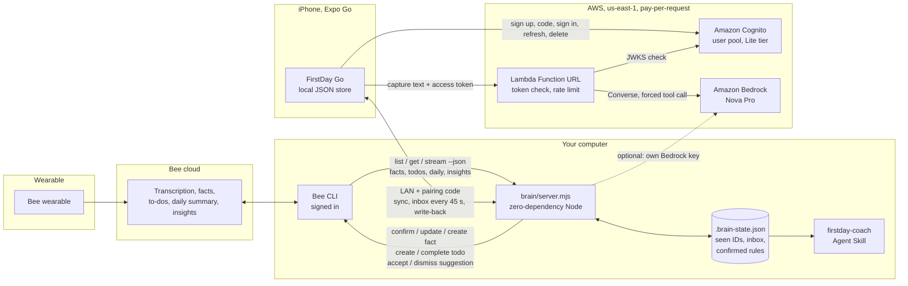

# FirstDay Go architecture

## Data paths

| Path | What moves | Where it's stored |
| --- | --- | --- |
| Bee → brain | Final processed transcripts (exact text, Bee's order), facts, to-dos, suggestions, daily summary, insights | Not stored by the brain, except IDs it has seen and the titles of new conversations waiting for the phone |
| Brain → phone | The same, on request, after the user ticks "everyone agreed" for a conversation | On the phone only |
| Phone → brain → Bee | Confirmed or fixed facts, kept and finished to-dos, accepted or skipped suggestions (switchable) | In Bee |
| Phone → brain | Confirmed work rules with practice levels, for the coach skill | `brain/.brain-state.json` (git-ignored) |
| Phone → AWS | One capture, question, task or practice answer, with a Cognito access token | Nowhere: passed to Bedrock and back. Error names only in logs (7 days) |

## Boundaries

- **Bee credentials stay on the computer.** The phone holds a 6-digit pairing code, never a Bee token. Five wrong
  codes lock an address out for 15 minutes; the phone's Cognito token goes only to the AWS endpoint (or a brain that requires accounts).
- **Consent before reading.** A Bee conversation isn't fetched or analysed until the user confirms everyone in it agreed.
- **Exact quotes.** Every to-do, memory and work step keeps the line it came from; feedback in practice quotes the trainer.
- **Untrusted text.** Transcripts are sent to Bedrock as data, with a system rule that they are never instructions;
  brain replies are validated field by field on the phone; Bee IDs are pattern-checked before reaching the CLI;
  on Windows, free text goes to Bee through `bee proxy` as JSON, never through a shell.
- **Works without any of it.** No brain, no account, no network: the app still captures, sorts, reminds and trains,
  reading text with on-phone rules.

## AWS resources (one CloudFormation stack)

| Resource | Setting | Why |
| --- | --- | --- |
| `AWS::Lambda::Function` `firstday-go-ai` | Node.js 22, arm64, 256 MB, 60 s | Cheapest Lambda shape; Bedrock replies take about 3 s |
| `AWS::Lambda::Url` | Auth NONE + Cognito JWT check in code, CORS for the app | No API Gateway to pay for; still only signed-in users |
| `AWS::IAM::Role` | Basic logs + `bedrock:InvokeModel` on Nova models only | Least privilege |
| `AWS::Logs::LogGroup` | 7-day retention | No transcripts logged; short retention anyway |
| Amazon Cognito user pool (created separately) | Lite tier, email + password, code confirmation | First 10,000 monthly active users free |
